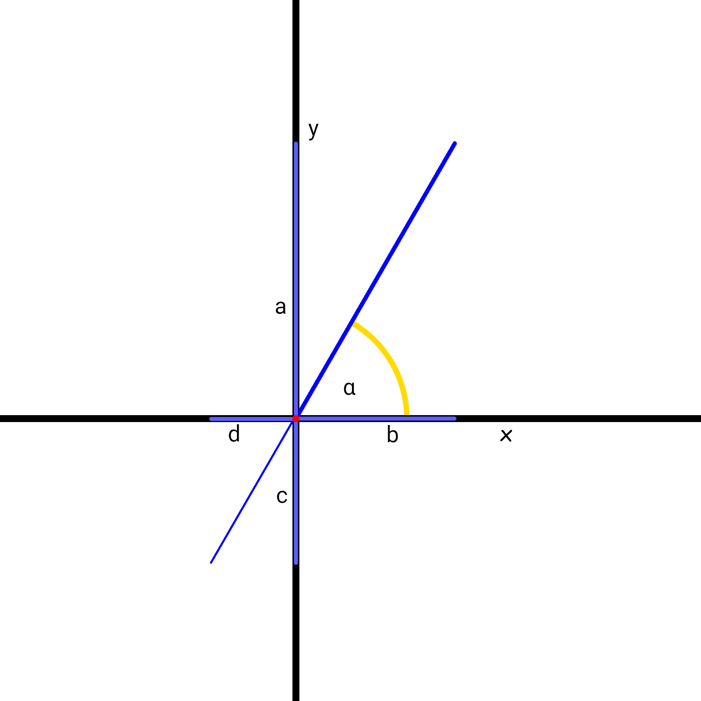
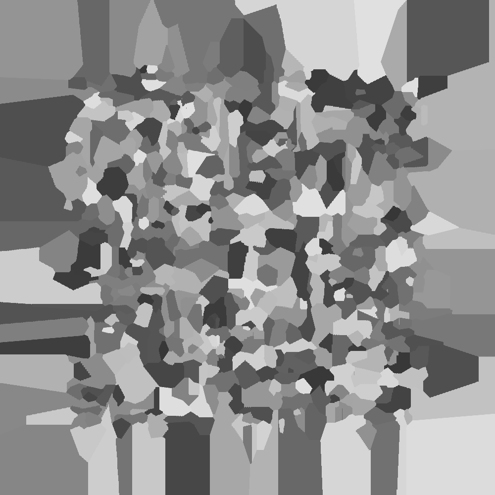
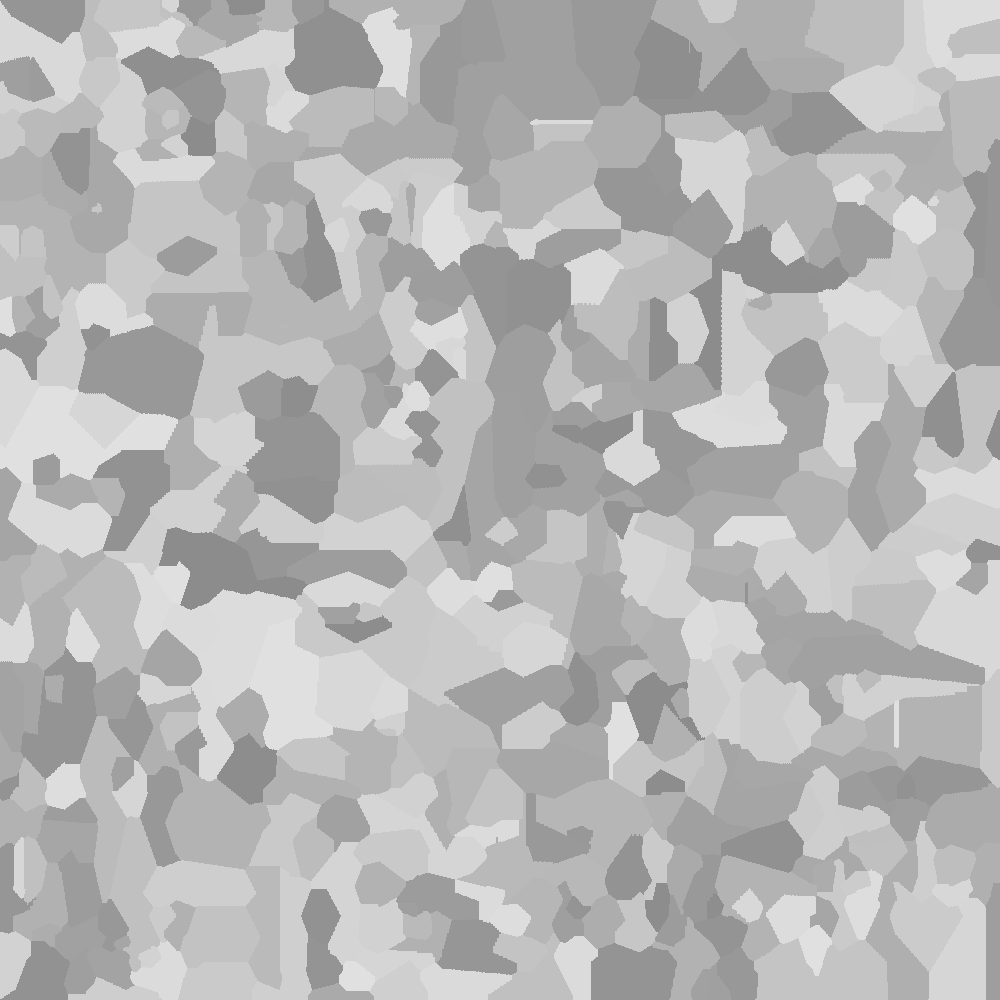
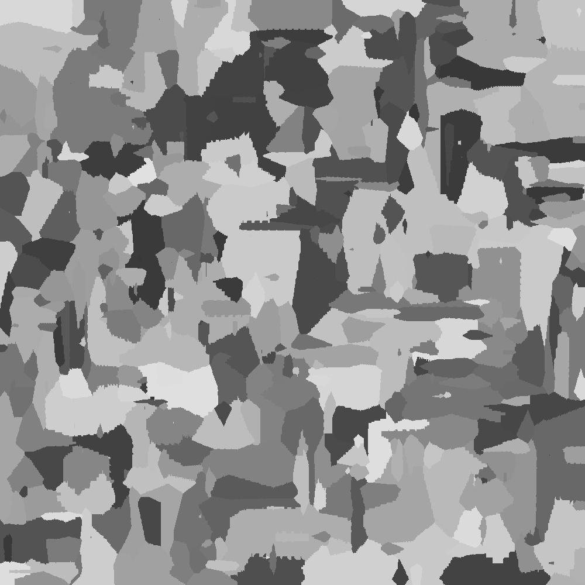

# Aufgabe 3  - Wortsuche

> **Team-ID** 00339
>
> **Team-Name** SilverBean
>
> **Bearbeiter der Aufgabe** Oskar Stanschus
>
> 19\. November 2022

## 1. Lösungsidee

Zur Generierung des Kristallmusters werden zuerst eine beliebige Zahl x an Keimen generiert. Diese werden in einem zweidimensionalen Array abgespeichert. Die Keime werden zufällig in einem definierten Bereich und in einer definierten Anzahl generiert. Daraufhin wird solange iteriert, bis das gesamte Feld voll mit Kristallen ist. Bei jeder Iteration wird durch alle Pixel iteriert und geprüft, ob der Pixel, welcher einen Kristall repräsentiert, bereits gewachsen ist. Ist der Kristall noch nicht gewachsen, wird ein Wachstum ausgelößt. Bei der Generierung der Keime wird jedem Kristall ein Wachstum nach *oben*, *unten*, *rechts* und *links* zugeteilt. Außerdem wird eine Zeit in Iterationen hinterlegt, nachdem der Keim anfängt zu wachsen, und eine Farbe, welche Abhängig von einem generierten Winkel ist. 

Die Generierung der Wachstumsrichtungen werden durch ursprünglich drei zufällig generierte Werte bestimmt. Diese Werte sind der Wachstumwinkel **α**, eine Wachstumsrate **w** und eine Wachstumsrate in die entgegengesetzte Richtung **o**. Mit Hilfe des Wachstumswinkel werden dann die Wachstumsrichtungen bestimmt. Die Wachstumsrate gibt an, wie schnell der Kristall wächst. Die Wachstumsrate in die entgegengesetzte Richtung gibt an, wie schnell der Kristall in die entgegengesetzte Richtung zum Winkel **α** wächst. Mithilfe dieser Parameter werden dann ein Wachstum auf der x-Achse und ein Wachstum auf der y-Achse berechnet. Dieses ist in dem Beispielbild zu sehen. Hierbei ist **a** das Wachstum auf der y-Achse und **b** das Wachstum auf der x-Achse. Diese Werte werden durch den Wachstumswinkel **α** bestimmt.
Das Wachstum auf der x-Achse wird über die Formel `cos(α) * w` berechnet. Das Wachstum auf der y-Achse wird über die Formel `sin(α) * w` berechnet.

Es gibt also nun ein Wachstum auf der x- sowie y-Achse. Diese werden dann zu einem Wachstum nach *oben*, *unten*, *rechts* und *links* übersetzt. In diesem aufgeführtem Beispiel ist **a** das Wachstum nach *oben*, **b** das Wachstum nach *rechts*, **c** das Wachstum nach *unten* und **d** das Wachstum nach *links*. Die Strecke a, also das Wachstum auf der y-Achse ist im Falle des Beispieles positiv. Das bedeutet, dass das Wachstum nach oben, also **a**, den Wert *Wachstum auf der Y-Achse* annimmt. Das Wachstum auf der x-Achse ist ebenfalls positiv, sodass das Wachstum nach rechts, also **b** , den Wert *Wachstum auf der x-Achse* annimmt. Nun bleibt noch das Wachstum nach unten und nach links zu bestimmen. Die Strecke **c** ist die Entgegengesetzte Seite zum Wachstumswinkel, sodass hier das Wachstum auf der *y-Achse* mit dem Faktor von **o** (Wachstumrate in die entgegengesetzte Richtung) reduziert wird, also mit der Formel `a * o`. Das Wachstum nach links ist ebenfalls die Entgegengesetzte Seite zum Wachstumswinkel, sodass auch hier das Wachstum auf der *x-Achse* mit dem Faktor von **o** reduziert wird.



Nun gibt es ein Wachstum für jede Richtung. Um den Keim dann Wachsen zu lassen, werden in Richtung nach oben, untent, rechts und links jeweils die Wachstumsstrecken **a**, **b**, **c** und **d** generiert. Dies wird mit einer einfachen Schleife durchgeführt, welche solange Pixel in die jeweilige Richtung generiert, bis ein Rand erreicht wird, ein Pixel mit einem anderen Kristall kollidiert oder genügend Wachstum für die jeweilige Richtung generiert wurde, also den Wert beispielsweise **a** erreicht hat.

Diese Prozedur wird so oft ausgeführt, bis das gesamte Feld mit Kristallen gefüllt ist.

## 2. Umsetzung

Das Programm wurde in JavaScript umgesetzt und wurde nachträglich mit "Prettier" formatiert. Zur einfachen Bedienung habe Ich das Script in einer einfachen Website eingebettet, sodass die Parameter sehr leicht geändert werden können. Um das Programm ausfzuführen muss lediglich die Datei "verzinkt.html" über einen beliebigen Browser geöffnet werden. Auf der Website können dann alle Parameter angepasst werden und dann über den Knopf "Generate" ein Muster generiert werden, welches dann auf der Website nach kurzer Zeit angepasst wird.

## 3. Beispiele

Die generierten Muster sind nicht reproduzierbar. Um vergleichbare Muster zu generieren können die Einstellungen unter den Bildern verwendet werden. Alle Beispiele haben die Größe 1000px x 1000px.

#### Beispiel 1


> **Anzahl an Keimen**: 500
> **Breite des Spawnbereichs**: 1000
> **Höhe des Spawnbereichs**: 1000
>
> **Wachstumwinkel**: 1 - 360
> **Wachstumwsgeschwindigkeit**: 1 - 5
> **Wachstum in umgekehrte Richtung**: 10 - 30
> **Wachstumstartzeit**: 1 - 5

#### Beispiel 2



> **Anzahl an Keimen**: 500
> **Breite des Spawnbereichs**: 750
> **Höhe des Spawnbereichs**: 750
>
> **Wachstumwinkel**: 1 - 360
> **Wachstumwsgeschwindigkeit**: 1 - 5
> **Wachstum in umgekehrte Richtung**: 10 - 30
> **Wachstumstartzeit**: 1 - 5

#### Beispiel 3



> **Anzahl an Keimen**: 500
> **Breite des Spawnbereichs**: 1000
> **Höhe des Spawnbereichs**: 1000
>
> **Wachstumwinkel**: 180 - 360
> **Wachstumwsgeschwindigkeit**: 1 - 5
> **Wachstum in umgekehrte Richtung**: 10 - 30
> **Wachstumstartzeit**: 1 - 5

#### Beispiel 4



> **Anzahl an Keimen**: 500
> **Breite des Spawnbereichs**: 1000
> **Höhe des Spawnbereichs**: 1000
>
> **Wachstumwinkel**: 1 - 360
> **Wachstumwsgeschwindigkeit**: 1 - 20
> **Wachstum in umgekehrte Richtung**: 10 - 30
> **Wachstumstartzeit**: 1 - 10

#### Beispiel 5


> **Anzahl an Keimen**: 500
> **Breite des Spawnbereichs**: 1000
> **Höhe des Spawnbereichs**: 1000
>
> **Wachstumwinkel**: 1 - 360
> **Wachstumwsgeschwindigkeit**: 1 - 5
> **Wachstum in umgekehrte Richtung**: 10 - 30
> **Wachstumstartzeit**: 1 - 60

## 4. Quellcode

```javascript
class Generator {
    filled = 0;
    constructor(canvas, settings) {
        this.settings = settings;
        this.canvas = canvas?.getContext("2d");
        (canvas.width = settings.width), (canvas.height = settings.height);
        this.canvas.clearRect(0, 0, this.settings.width, this.settings.height);
        this.crystals = new Array(settings.height).fill(0).map((x) => new Array(settings.width).fill(null)); // Kristall-Array erstellen
    }
    // Setzt einen Kristall an die angegebene Position, wenn möglich. Gibt true zurück, wenn erfolgreich.
    async setCrystal(crystalData, position) {
        if (
            !(
                position.y > this.crystals.length - 1 ||
                position.x > this.crystals[0].length - 1 ||
                position.x < 0 ||
                position.y < 0
            ) &&
            (this.crystals[position.y][position.x] == null || this.crystals[position.y][position.x].time > 1)
        ) {
            this.crystals[position.y][position.x] = crystalData;
            this.filled++;
            // Kristall zeichnen
            this.canvas.fillStyle = crystalData.color;
            this.canvas.fillRect(position.y, position.x, 1, 1);
            return true;
        }
        return false;
    }
    // Muster generieren
    async generate() {
        // Keime generieren
        for (let i = 0; i < this.settings.spawn.amount; i++) {
            const position = {
                x: Generator.randomInt(
                    (this.settings.width - this.settings.spawn.width) / 2,
                    (this.settings.width + this.settings.spawn.width) / 2 - 1
                ),
                y: Generator.randomInt(
                    (this.settings.height - this.settings.spawn.height) / 2,
                    (this.settings.height + this.settings.spawn.height) / 2 - 1
                ),
            }; // Zufällige Position im Spawnbereich
            const growthValues = {
                angle: Generator.random(this.settings.growth.angle.min, this.settings.growth.angle.max), // Winkel, in dem der Kristall wächst
                growthRate: Generator.random(this.settings.growth.rate.min, this.settings.growth.rate.max), // Wachstumsrate (in Kristallen pro Tick)
                oppositeGrowth: Generator.random(this.settings.growth.opposite.min, this.settings.growth.opposite.max), // Wachstumsrate in die entgegengesetzte Richtung
            };
            const dirGrowth = {
                x: Generator.notZero(Math.cos(growthValues.angle) * growthValues.growthRate), // Wachstum in x-Richtung
                y: Generator.notZero(Math.sin(growthValues.angle) * growthValues.growthRate), // Wachstum in y-Richtung
            };
            const pixelGrowth = {
                up: Math.ceil(Math.abs(dirGrowth.y > 0 ? dirGrowth.y : dirGrowth.y * growthValues.oppositeGrowth)),
                down: Math.ceil(Math.abs(dirGrowth.y < 0 ? dirGrowth.y : dirGrowth.y * growthValues.oppositeGrowth)),
                left: Math.ceil(Math.abs(dirGrowth.x < 0 ? dirGrowth.x : dirGrowth.x * growthValues.oppositeGrowth)),
                right: Math.ceil(Math.abs(dirGrowth.x > 0 ? dirGrowth.x : dirGrowth.x * growthValues.oppositeGrowth)),
            }; // Wachstum in Pixeln übersetzt mit Wachstumsrate in entgegengesetzter Richtung
            const color = `rgb(${Math.floor(55 + (growthValues.angle / 360) * 170)}, ${Math.floor(
                55 + (growthValues.angle / 360) * 170
            )}, ${Math.floor(55 + (growthValues.angle / 360) * 170)})`; // Farbe des Kristalls aus dem Winkel berechnen
            if (
                !this.setCrystal(
                    {
                        growth: pixelGrowth,
                        color: color,
                        time: Generator.randomInt(this.settings.growth.time.min, this.settings.growth.time.max),
                    },
                    position
                )
            )
                i--;
        }
        // Wachstum der Kristalle
        while (this.filled < this.settings.width * this.settings.height) {
            const tempCrystals = Generator.deepCopy(this.crystals);
            this.settings.update?.(this.filled / (this.settings.width * this.settings.height)); // Anzeige im Browser aktualisieren, falls vorhanden
            for (let y = 0; y < this.crystals.length; y++)
                for (let x = 0; x < this.crystals[0].length; x++) {
                    if (tempCrystals[y][x] == null) continue;
                    let crystal = this.crystals[y][x];
                    if (crystal == null || crystal.time-- > 0 || crystal.grew) continue;
                    // Wachstum nach oben, unten, links und rechts
                    for (let i = 1; i < crystal.growth.up + 1; i++)
                        if (!this.setCrystal(Generator.deepCopy(crystal), { x: x, y: y - i })) break;
                    for (let i = 1; i < crystal.growth.down + 1; i++)
                        if (!this.setCrystal(Generator.deepCopy(crystal), { x: x, y: y + i })) break;
                    for (let i = 1; i < crystal.growth.left + 1; i++)
                        if (!this.setCrystal(Generator.deepCopy(crystal), { x: x - i, y: y })) break;
                    for (let i = 1; i < crystal.growth.right + 1; i++)
                        if (!this.setCrystal(Generator.deepCopy(crystal), { x: x + i, y: y })) break;
                    crystal.grew = true;
                }
            await new Promise((resolve) => setTimeout(resolve, 0)); // Warten, damit der Browser nicht einfriert
        }
    }
    static notZero = (value) => (Math.ceil(Math.abs(value)) * value) / Math.abs(value); // Rundung für Werte, die nicht 0 sein dürfen
    static random = (min, max) => Math.random() * (max - min) + min; // Zufallszahl zwischen min und max
    static randomInt = (min, max) => Math.floor(Math.random() * (max - min + 1) + min); // Zufällige Ganzzahl zwischen min und max
    static deepCopy = (element) => JSON.parse(JSON.stringify(element)); // Kopieren eines Objektes ohne Referenz
}
```

